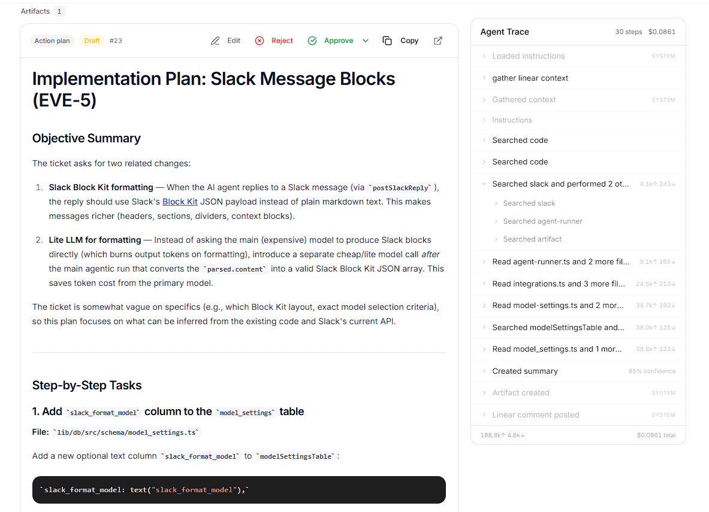
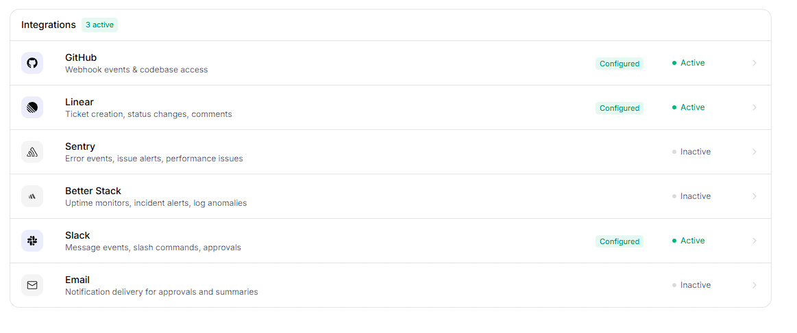
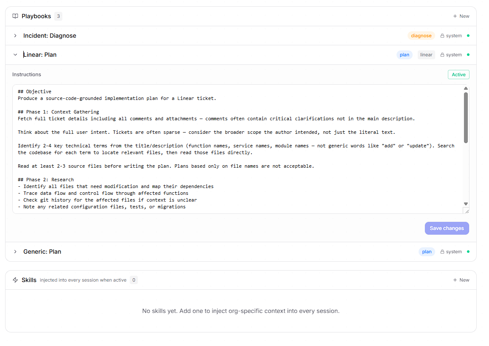
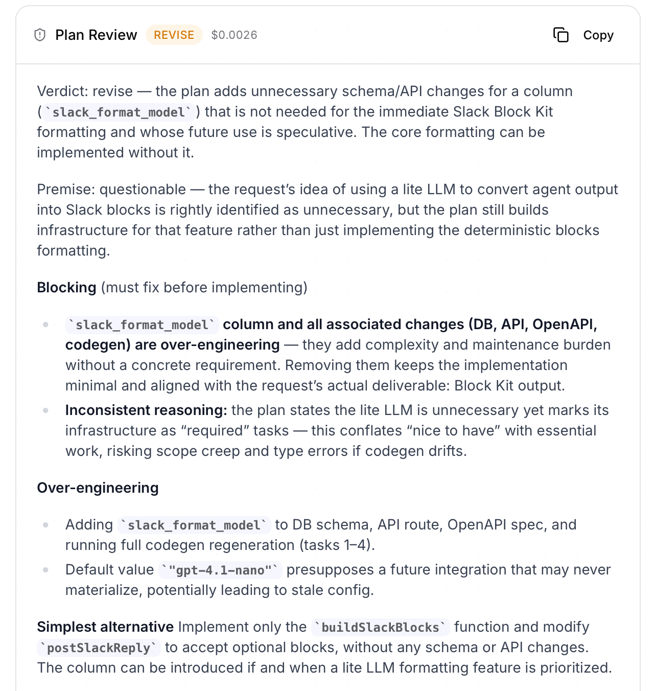

# Moonga aka (Oncident, Eventmesh)

I built this over a weekend because I couldn't find a tool that fit how I actually work. Tried a bunch of review and planning tools — some were close, none quite right — so I just built it. Costs almost nothing to run, works well for me and my team, and now I'm putting it out there in case someone else has the same problem.

It receives operational events via webhooks (GitHub, Linear, Sentry, Better Stack, Slack), runs an AI agent to draft a plan or incident report, and blocks on your review before sending anything anywhere. Human in the loop by design.

---

## What it looks like

**Generated plan for a Linear ticket**



**Integrations**



**Playbooks**



---

## How it works

1. **Ingest** — Webhooks arrive from connected tools.
2. **Event** — Each webhook becomes an `Event` record with extracted metadata (source, type, severity, title).
3. **Session** — Every event spawns an AI `Session` with an objective:
   - `diagnose` for incidents, errors, and anomalies
   - `plan` for Linear tickets and feature requests
4. **Artifact** — The AI drafts an output (incident report, implementation plan, etc.).
5. **Review** — Artifacts land in a human review queue: `draft` → `approved` / `rejected` / `edited`.
6. **Resolution** — Approved artifacts finalize the session and output goes wherever you configured it.

It does not touch your code, open PRs, or deploy anything. The output is a plan. You decide what happens next.

Every generated plan also gets a **critic pass** — a second agent that adversarially reviews the first agent's output and flags gaps, assumptions, or things worth reconsidering. AI plans aren't always right on the first try, and different runs give you different answers, so having something that pushes back before you approve gives you a bit more confidence in what you're signing off on. You can use the critique to revise and rerun, or just proceed if it checks out.



---

## Stack

- pnpm workspaces, Node.js 22 LTS, TypeScript 5.9
- Frontend: React + Vite + Tailwind CSS
- API: Express 5
- DB: PostgreSQL + Drizzle ORM
- Validation: Zod, drizzle-zod
- API codegen: Orval (from OpenAPI spec)
- Build: esbuild

---

## Self-hosting

### Docker Compose (recommended)

```bash
cp .env.example .env
# Edit .env — at minimum set POSTGRES_PASSWORD and BETTER_AUTH_SECRET
docker compose up -d
```

The API container pushes the database schema on startup. No manual migration step needed.

### One-command VPS setup

```bash
export REPO_URL=https://github.com/YOUR_USER/YOUR_REPO.git
export DOMAIN=your-domain.com   # optional, for HTTPS
bash deploy/vps-setup.sh
```

Installs Docker, clones the repo, generates secrets, builds, and starts everything.

### First user

Sign-up is open by default so you can create your account right after deploying.

1. Open the app and register.
2. Set `ALLOW_SIGNUP=false` and `VITE_ALLOW_SIGNUP=false` in `.env`.
3. Rebuild to close registration:
   ```bash
   docker compose up -d --build
   ```

---

## Local dev

```bash
pnpm install

# Push DB schema (dev only — no migrations, uses drizzle-kit push)
pnpm db:push

# Start API server + frontend together
pnpm dev
```

Requires: Node.js 22+, pnpm, PostgreSQL 16+, `DATABASE_URL` env var.

---

## Webhook endpoints

Point your tools at:

- `POST /api/webhooks/github`
- `POST /api/webhooks/linear`
- `POST /api/webhooks/sentry`
- `POST /api/webhooks/betterstack`
- `POST /api/webhooks/slack`

---

## Project structure

```
lib/
  api-spec/openapi.yaml      # API contract source of truth
  db/src/schema/             # Drizzle table definitions
  api-zod/                   # Generated Zod schemas
  api-client-react/          # Generated React Query hooks

apps/
  api-server/src/routes/     # Express route handlers
  frontend/src/pages/        # React pages
  frontend/src/components/   # Shared UI components
```

After any change to `openapi.yaml`, regenerate before touching frontend code:

```bash
pnpm --filter @workspace/api-spec run codegen
```

---

## License

MIT
